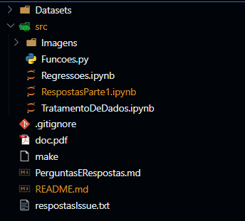

## Sumário
- [TRABALHO ANÁLISE DE DADOS ENFOQUE NA PANDEMIA](#trabalho-análise-de-dados-enfoque-na-pandemia)
  - [😎 Alunos](#-alunos)
  - [🎯 Objetivos](#-objetivos)
  - [✍️ Introdução](#️-introdução)
  - [❓ Perguntas](#-perguntas)
  - [📝 Análise superficial dos dados](#-análise-superficial-dos-dados)
  - [💭 Coluna código\_situação](#-coluna-código_situação)
  - [🚦 Organização do trabalho](#-organização-do-trabalho)
- [🔍 Overview do Trabalho](#-overview-do-trabalho)
  - [Tratamento de dados](#tratamento-de-dados)
  - [Respostas as perguntas](#respostas-as-perguntas)
- [Referências](#referências)

# TRABALHO ANÁLISE DE DADOS ENFOQUE NA PANDEMIA 

A análise dos dados foi especificada no notebook a seguir: [link notebook](./Trabalho_CDD.ipynb)
## 😎 Alunos
- Guilherme Broedel Zorzal - 5064 - [GuilhermeZorzal](https://github.com/GuilhermeZorzal)
- Eduardo Antunes dos Santos Vieira - 5076 - [eduardo-antunes](https://github.com/eduardo-antunes)
- Maria Eduarda de Pinho Braga - 5099 -  [Duds04](https://github.com/Duds04)
- João Gabriel Angelo Bradachi - 5078 - [JBradachi](https://github.com/JBradachi)

## 🎯 Objetivos 

O seguinte trabalho prático têm por objetivo analisar e tirar conclusões acerca dos alunos da Universidade Federal de Viçosa. 

## ✍️ Introdução
A UFV é uma grande universidade, com grande diversidade e alunos vindos de diversos contextos e realidades. A partir de dados como etnias, renda, coeficiente de rendimento, local de origem, etc é possível explorar tais diferenças e singularidades, podendo encontrar conhecimentos úteis que podem, inclusive, melhorar a vida desses alunos e ajudá-los em sua caminhada pelo ensino superior e sua formação. 

Tendo isso em vista, este trabalho visou levantar e explorar essas perguntas que possivelmente tragam informações relevantes sobre os alunos. Algumas perguntas têm o enfoque específico a pandemia que foi um período que marcou significadamente uma variação no processos da faculdade. 

## ❓ Perguntas 
1. Como a quarentena influenciou a taxa de evasão? (no geral e por cota)
2. Como evoluiu a declaração étnica ao longo do tempo?
3. Como evoluiu o perfil étnico da universidade ao longo do tempo, em particular no pré, durante e pós pandemia?
4. Qual é a relação entre a cota de ingresso dos alunos e sua região (estado/sub-região?) de origem?
5. A quarentena influenciou a diversidade regional dos alunos? Se sim, como?
6. A quarentena influenciou a diversidade de sexo biológico dos alunos? Se sim, como?
7. Qual foi a influência da pandemia no coeficiente de rendimento acadêmico por curso? (baseando-se no ano de ingresso dos alunos) 
8. Como a demanda por curso foi afetada pela passagem do tempo e pela pandemia?
9. Como é o perfil dos alunos que evadiram ao longo do tempo e por curso? (no geral e atributos específicos)
10. Qual é o tempo de permanência média por curso ao longo do tempo? (destaque para a pandemia)
11. Como é o perfil dos alunos de cada campus nos anos analisados?
12. Como evoluíram as notas do enem por curso ao longo do tempo (por ano)? E como foi essa evolução por contas?
13. Como é a média do CR por curso e por ano?
14. Qual campus recebe mais pessoas de fora do estado de Minas Gerais?
15. O tempo de duração definido para cada curso condiz com a media de duração gasto pelos alunos?

Formulamos 4 perguntas extras além das 10 requeridas, para caso seja necessário descartar alguma pergunta por impossibilidade de implementações.

## 📝 Análise superficial dos dados

## 💭 Coluna código_situação

Uma das colunas do conjunto de dados é a `Codigo_Situacao_Aluno`, que apresenta diversos valores. O significados dos valores é dado pela tabela abaixo

| Símbolo    | Significado |
| -------- | ------- |
| A | Abandono |
| B | Concluiu, mas não colou grau |
| C | Conclusão |
| D | Desligamento |
| F | Falecimento |
| G | Afastamento/intercâmbio |
| H | Habilitação |
| I | Concluiu, mas o relatório não foi analisado |
| J | Matrícula temporariamente suspensa |
| K | Trancamento |
| M | Mudança de curso |
| N | Normal |
| Q | Matrícula condicional (desligamento reconsiderado) |
| R | Afastamento (desligamento reconsiderado) |
| T | Transferência |
| S | Anulamento de matrícula |
| W | Afastamento especial |
| X | Exclusão |
| Y | Afastamento |
| Z | Trancamento por motivo de saúde |

## 🚦 Organização do trabalho 

Devido à alta quantidade de arquivos gerados durante a elaboração do trabalho, esses foram divididos em duas pastas principais:
- `Datasets` = É a pasta que contém todos os arquivos de dados utilizados durante o trabalho prático. Isso inclui o datasets com os dados dos alunos, que é o foco do trabalho, bem como outros datasets auxiliares utilizados para responder certas perguntas no trabalho.
- `src` = É a pasta que contém os arquivos `.py` e `.ipynb` criados durante o trabalho. Nele estão o tratamento dos dados e as análises feitas com base nas perguntas previamente formuladas pelo grupo
- `src/Imagens` = Vale ressaltar que dentro da pasta `src` existe a pasta `Imagens`, que contém algumas imagens que foram utilizadas durante o trabalho para ilustrar melhor os resultados obtidos

  
# 🔍 Overview do Trabalho

Para a execução do trabalho e para uma boa organização d trabalho, foram utilizados um notebook Jupyter para cada tarefa que percebemos ser necessária realizar com o dataset. Os arquivos utilizados para essas análises e tratamentos são os contidos dentro do diretório `src`. 

## Tratamento de dados

Para que uma boa análise seja feita, é necessário que os dados estejam limpos e bem organizados. Porém o dataset original continha diversos problemas que precisavam ser resolvidos e padronizados, tais como problema de digitação e dados faltosos. Portanto, era necessário que o dataset original fosse submetido a uma limpeza.

O arquivo [`TratamentoDeDados.ipynb`](src/TratamentoDeDados.ipynb) foi o arquivo utilizado para realização do tratamento de dados. Todas as etapas realizadas estão explicadas dentro do arquivo, bem como algumas decisões importantes que foram tomadas. 

O único ponto que vale a pena ressaltar é que ao fim do tratamento, correção e enriquecimento do dataset, terminamos com algumas colunas que não existiam no dataset original, que são: 

- Area;
- Admissao_Ano;
- Admissao_Semestre;
- Saida_Ano;
- Saida_Semestre;

A coluna `area` contém a classificação dos cursos por área de conhecimento, enquando as colunas `Admissao_Ano`, `Admissao_Semestre`, `Saida_Ano`, `Saida_Semestre` são os anos de Saida e Admissao dividos em anos e semestre, para facilitar em algumas análises

O processo de obtenção das colunas foi devidamente explicado dentro do notebook.

## Respostas as perguntas
Principal, que que foi feito, foco em que tivemos, métodos usados, etc

# Referências

https://agenciadenoticias.ibge.gov.br/agencia-noticias/2012-agencia-de-noticias/noticias/38719-censo-2022-pela-primeira-vez-desde-1991-a-maior-parte-da-populacao-do-brasil-se-declara-parda

http://portal.mec.gov.br/component/tags/tag/politica-de-cotas#:~:text=A%20política%20de%20cotas%20foi,proposta%20foi%20aprovada%20por%20unanimidade.

